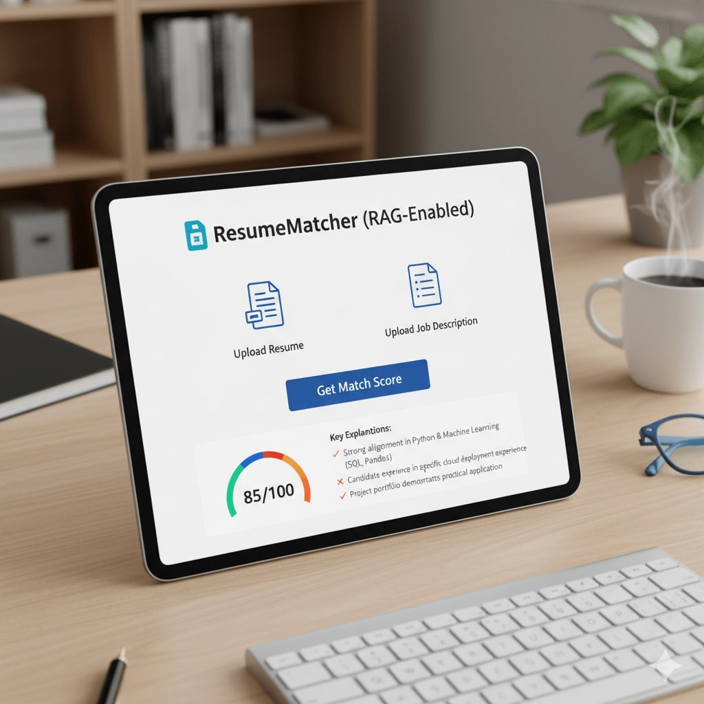
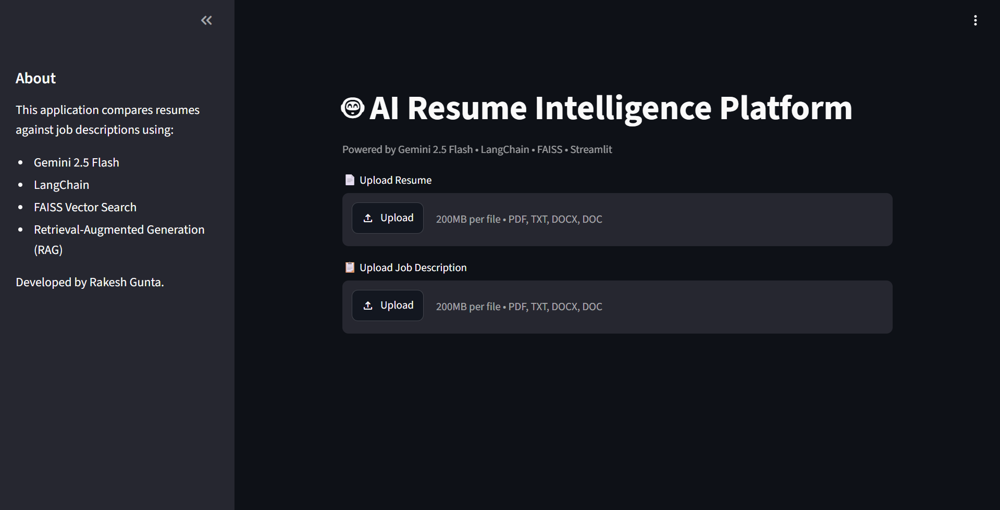
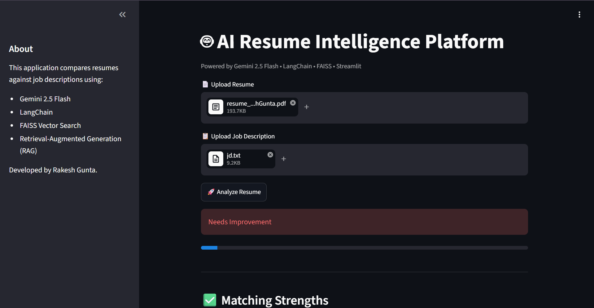

Yes. Since you've changed the project from **OpenAI + GPT-3.5** to **Gemini 2.5 + Gemini Embeddings** and enhanced the UI, your README should reflect those changes. Here's an updated version you can use.

---

# AI Resume Intelligence Platform (RAG-Enabled)

<div align="center">

# 🤖 AI Resume Intelligence Platform

AI-powered ATS Resume Analyzer using **Gemini 2.5 Flash**, **LangChain**, **FAISS**, and **Retrieval-Augmented Generation (RAG)**.



</div>

---

# Project Overview

**AI Resume Intelligence Platform** helps candidates evaluate how well their resumes match a job description using **Google Gemini**, **LangChain**, and **FAISS vector search**.

Instead of simple keyword matching, the system performs **semantic similarity search** using **Retrieval-Augmented Generation (RAG)**, enabling context-aware resume analysis and personalized recommendations.

The application provides:

* 🎯 ATS Match Score
* ✅ Candidate Strengths
* ❌ Missing Skills
* 💡 Resume Improvement Suggestions
* 🎤 AI-generated Interview Questions

Users can analyze resumes through both a **CLI** and a **Streamlit Web Application**.

---

# Architecture

```
Resume + Job Description
            │
            ▼
Text Extraction (PDF/DOCX/TXT)
            │
            ▼
Text Cleaning
            │
            ▼
Gemini Embeddings
            │
            ▼
FAISS Vector Database
            │
            ▼
Relevant Context Retrieval (RAG)
            │
            ▼
Gemini 2.5 Flash
            │
            ▼
ATS Score + AI Recommendations
```

---

# Features

* 📄 Supports PDF, DOCX and TXT files
* 🤖 Gemini 2.5 Flash powered analysis
* 🧠 Retrieval-Augmented Generation (RAG)
* 🔍 Semantic search using FAISS
* 📊 ATS Match Score
* ✅ Matching strengths
* ❌ Missing skills detection
* 💡 Resume improvement suggestions
* 🎤 Personalized interview questions
* 📥 Downloadable JSON analysis report
* 🌐 Streamlit Web Interface
* 💻 Command Line Interface (CLI)

---

# Tech Stack

| Category        | Technologies            |
| --------------- | ----------------------- |
| Language        | Python                  |
| LLM             | Gemini 2.5 Flash        |
| Embeddings      | Gemini Embedding-2      |
| Framework       | LangChain               |
| Vector Database | FAISS                   |
| UI              | Streamlit               |
| Parsing         | pdfplumber, python-docx |
| Environment     | python-dotenv           |

---

# Repository Structure

```
.
├── data
│   ├── resumes/
│   └── jds/
│
├── cache/
│
├── index/
│
├── images/
│
├── src/
│   └── main.py
│
├── requirements.txt
├── README.md
└── LICENSE
```

---

# Installation

Clone the repository

```bash
git clone https://github.com/<your-username>/AI-Resume-Intelligence-Platform.git

cd AI-Resume-Intelligence-Platform
```

Create virtual environment

```bash
python -m venv venv
```

Linux / macOS

```bash
source venv/bin/activate
```

Windows

```bash
venv\Scripts\activate
```

Install dependencies

```bash
pip install -r requirements.txt
```

Create a `.env` file

```env
GOOGLE_API_KEY=YOUR_GEMINI_API_KEY
```

---

# Usage

## Index Documents

```bash
python src/main.py --action index --data-dir ./data --index-dir ./index
```

---

## Match Resume (CLI)

```bash
python src/main.py \
--action match \
--resume ./data/resumes/resume.pdf \
--jd ./data/jds/job.pdf \
--index-dir ./index
```

---

## Run Streamlit

```bash
streamlit run src/main.py -- --action serve
```

---

# Example Output

```
ATS Match Score
92%

✅ Matching Strengths

• Strong Python experience
• Experience with AWS
• Machine Learning knowledge
• Backend Development
• REST API Development

❌ Missing Skills

• Docker
• Kubernetes
• TensorFlow

💡 Resume Improvements

• Quantify project impact
• Add cloud deployment experience
• Mention scalable system design

🎤 Interview Questions

• Explain FAISS indexing.
• What is Retrieval-Augmented Generation?
• How does semantic search work?
```

---

# Future Improvements

* Export report as PDF
* Multi-resume comparison
* Skill gap visualization
* Resume keyword highlighting
* Company-specific ATS optimization
* Cover Letter Generator
* AI Resume Rewriter
* Dashboard Analytics

---

```md
## Application

### Home



### Resume Analysis


```

---
